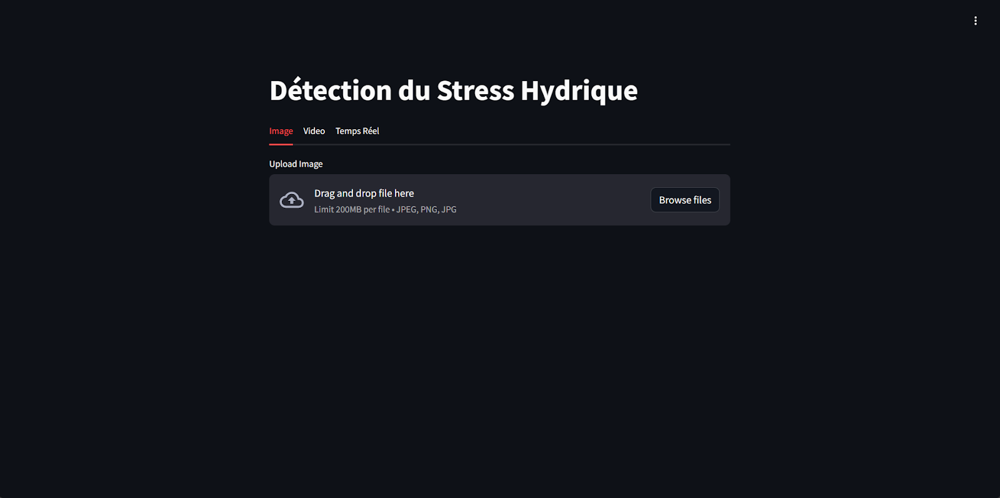
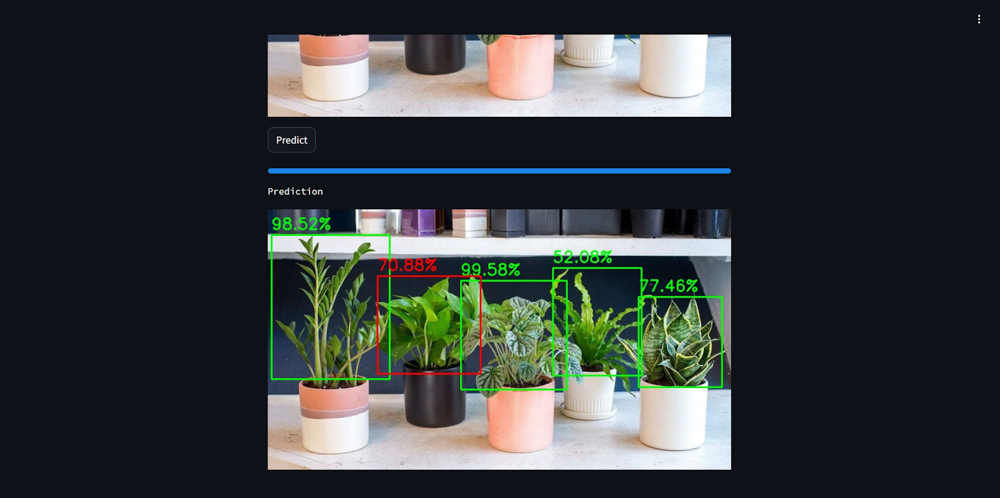
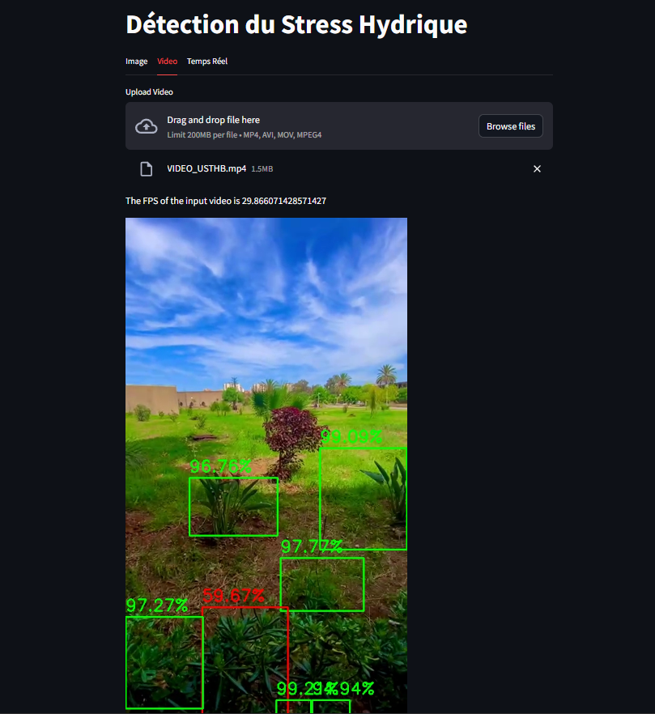
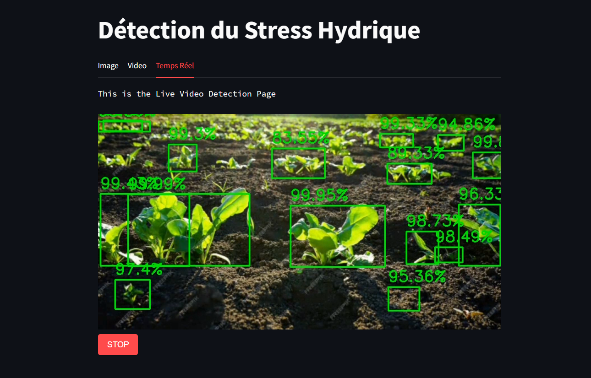

# Desktop Application

## Overview
The desktop application allows users to monitor water stress in plants across large fields using images and videos. The application supports real-time detection and uses a pre-trained model for accuracy.

## Installation
1. Clone this repository.
2. Navigate to the `DesktopApp` directory.
3. Install the required dependencies:
4. Run the application: `streamlit run main.py`

## Screenshots

## Usage
1. Launch the application.
2. Upload an image or video.
3. Click on "Predict" to analyze the water stress on all plants.

## Contributing
Feel free to contribute to the development of the desktop application. Please follow the guidelines in the main README.md file.

## License
This application is licensed under the MIT License - see the `LICENSE` file in the main directory for details.
